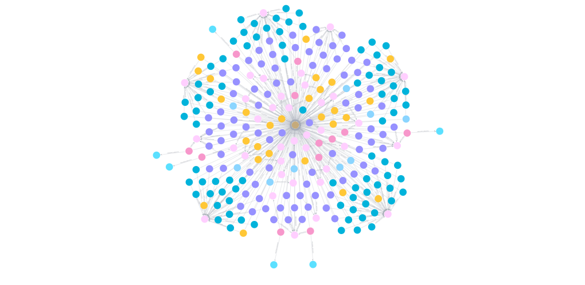

# fhir-graph

A demo that loads a single synthetic FHIR R4 patient record into a Neo4j graph database.

---

## Background: What is FHIR?

**HL7 FHIR** (Fast Healthcare Interoperability Resources, R4) is the modern standard for exchanging healthcare data between systems.  A FHIR record is made up of discrete **resources** - Patient, Encounter, Condition, Observation, Procedure, MedicationRequest, Immunization, and many more.  These resources link to each other using **references** (essentially foreign keys), forming a natural graph.

A **Bundle** is a collection of resources bundled together - in this demo, one Bundle contains the complete clinical history of one synthetic patient.

**Data source:** [Synthea](https://synthea.mitre.org/downloads) - 100 Sample Synthetic Patient Records, FHIR R4 (36 MB).  
**File used in this demo:** `synthea-fhir/Addie421_Isabelle619_Johns824_c72a8c6e-1dfd-0a8b-20e7-066eadd4931c.json`  
The bundle contains 476 entries spanning the lifetime of one synthetic patient (born 1980, Arlington MA).

Future work would loop over all 100 patient files to build a multi-patient graph and query cross-patient patterns.

---

## Background: What is Neo4j?

**Neo4j** is a property graph database.  Instead of tables and joins, data is stored as:

- **Nodes** - entities with a label (e.g. `:Patient`, `:Encounter`) and key/value properties
- **Relationships** - directed, named edges between nodes (e.g. `-[:FOR_PATIENT]->`) that also carry properties
- **Cypher** - Neo4j's query language, designed to read like a diagram: `(a)-[:REL]->(b)`

FHIR data maps naturally to a graph: every resource reference (`"subject": {"reference": "Patient/abc"}`) becomes a relationship.  A graph database makes those connections traversable in a single query - no joins, no foreign key lookups.

---

## Graph Schema

After running the loader, the database contains these node labels and relationship types:

```
(:Patient)
(:Encounter)         -[:FOR_PATIENT]->        (:Patient)
(:Condition)         -[:FOR_PATIENT]->        (:Patient)
                     -[:DURING_ENCOUNTER]->   (:Encounter)
(:Observation)       -[:FOR_PATIENT]->        (:Patient)
                     -[:DURING_ENCOUNTER]->   (:Encounter)
(:Procedure)         -[:FOR_PATIENT]->        (:Patient)
                     -[:DURING_ENCOUNTER]->   (:Encounter)
(:Medication)
(:MedicationRequest) -[:FOR_PATIENT]->        (:Patient)
                     -[:DURING_ENCOUNTER]->   (:Encounter)
                     -[:PRESCRIBED_MEDICATION]->(:Medication)
(:Immunization)      -[:FOR_PATIENT]->        (:Patient)
                     -[:DURING_ENCOUNTER]->   (:Encounter)
```

---

## Setup & Running

### Prerequisites

- [Docker Desktop](https://www.docker.com/products/docker-desktop)
- Python 3.8+

---

### Step 1 - Start Neo4j in Docker

```
# Windows (Command Prompt)
docker run -d ^
  --name fhir-neo4j ^
  -p 7474:7474 ^
  -p 7687:7687 ^
  -e NEO4J_AUTH=neo4j/password ^
  neo4j:latest
```

`-p 7474:7474` exposes the browser UI.  `-p 7687:7687` exposes the Bolt protocol used by the Python driver.  `NEO4J_AUTH` sets the username/password.

Wait ~15 seconds for the container to start, then verify:

```
docker logs fhir-neo4j
# Look for: Started.
```

Open **http://localhost:7474** in your browser and log in with `neo4j` / `password`.

---

### Step 2 - Install Python Dependencies

Installs the `neo4j` Bolt driver.

```
python -m venv .venv

# Activate
.\.venv\Scripts\activate

pip install -r requirements.txt
```

---

### Step 3 - Run the Loader

```
python fhir_to_neo4j.py
```

Expected output:

```
[LOAD] Reading synthea-fhir/Addie421_Isabelle619_Johns824_c72a8c6e-1dfd-0a8b-20e7-066eadd4931c.json
  476 entries in bundle

[CONNECT] bolt://localhost:7687
  Connected

[IMPORT]
  Condition: 27
  Encounter: 36
  Immunization: 9
  Medication: 6
  MedicationRequest: 12
  Observation: 83
  Patient: 1
  Procedure: 87

[SUMMARY]
  Nodes:
    Condition: 27
    Encounter: 36
    Immunization: 9
    Medication: 6
    MedicationRequest: 12
    Observation: 83
    Patient: 1
    Procedure: 87
  Relationships:
    DURING_ENCOUNTER: 218
    FOR_PATIENT: 254
    PRESCRIBED_MEDICATION: 6

Done.
```

---

### Step 4 - Stop Neo4j (When Done)

```
docker stop fhir-neo4j
docker rm fhir-neo4j
```

---

## Analysis: Example Cypher Queries

Run these queries in the Neo4j Browser at **http://localhost:7474** (use the query box at the top).  Each result is cross-referenced to the source FHIR JSON to validate correctness.

---

### 1. Who is the patient?

```cypher
MATCH (p:Patient)
RETURN p.name, p.birthDate, p.gender, p.city, p.state, p.phone
```

**Expected result:**

| p.name | p.birthDate | p.gender | p.city | p.state | p.phone |
|--------|-------------|----------|--------|---------|---------|
| Addie421 Isabelle619 Johns824 | 1980-08-12 | female | Arlington | MA | 555-123-2135 |

**FHIR validation:** The `Patient` resource at the top of the bundle has `"gender": "female"`, `"birthDate": "1980-08-12"`, and a `name` array with `given: ["Addie421", "Isabelle619"]` and `family: "Johns824"`.

---

### 2. How many encounters did she have, and what types?

```cypher
MATCH (e:Encounter)-[:FOR_PATIENT]->(p:Patient)
RETURN e.type, count(*) AS visits
ORDER BY visits DESC
```

**Expected result (top rows):**

| e.type | visits |
|--------|--------|
| General examination of patient (procedure) | 14 |
| Encounter for check up (procedure) | 7 |
| Dental consultation and report (procedure) | 5 |
| ... | ... |

**FHIR validation:** There are 36 `Encounter` entries in the bundle, each with a `"subject"` reference pointing to the Patient UUID `c72a8c6e-1dfd-0a8b-20e7-066eadd4931c`.

---

### 3. What conditions does she have?

```cypher
MATCH (c:Condition)-[:FOR_PATIENT]->(p:Patient)
RETURN c.display, c.clinicalStatus, c.onset
ORDER BY c.onset
```

**Expected result (sample rows):**

| c.display | c.clinicalStatus | c.onset |
|-----------|-----------------|---------|
| Received higher education (finding) | active | 1998-10-06T09:16:02+00:00 |
| Loss of teeth (disorder) | active | 2002-11-05... |
| Body mass index 30+ - obesity (finding) | active | 2014-10-28... |
| Stress (finding) | active | 2020-08-18... |
| ... | ... | ... |

**FHIR validation:** The bundle contains 27 `Condition` resources, each with a `"subject"` reference pointing to the Patient and a `"clinicalStatus"` coding of either `active` or `resolved`.

---

### 4. What medications were prescribed?

```cypher
MATCH (mr:MedicationRequest)-[:FOR_PATIENT]->(p:Patient)
MATCH (mr)-[:PRESCRIBED_MEDICATION]->(m:Medication)
RETURN m.display, mr.status, mr.authoredOn
ORDER BY mr.authoredOn
```

**Expected result:**

| m.display | mr.status | mr.authoredOn |
|-----------|-----------|---------------|
| Etonogestrel 68 MG Drug Implant | completed | 2017-03-28... |
| sodium fluoride 0.0272 MG/MG Oral Gel | completed | 2022-08-23... |
| levonorgestrel 0.000813 MG/HR Intrauterine System [Liletta] | completed | 2022-10-04... |
| ... | ... | ... |

**FHIR validation:** Each `MedicationRequest` resource contains either a `"medicationReference"` pointing to a `Medication` resource UUID or an inline `"medicationCodeableConcept"`.  The 6 requests that use `medicationReference` produce a `PRESCRIBED_MEDICATION` relationship to a `Medication` node holding the drug name in `code.text`.  The remaining 6 requests embed the drug name inline and have no separate `Medication` node.  There are 12 `MedicationRequest` entries and 6 distinct `Medication` nodes.

---

### 5. What happened during a specific encounter?

This query shows the power of the graph model: traverse from a single visit to everything that was recorded during it.

```cypher
MATCH (e:Encounter {id: "c72a8c6e-1dfd-0a8b-16f6-642a2185390e"})
OPTIONAL MATCH (c:Condition)-[:DURING_ENCOUNTER]->(e)
OPTIONAL MATCH (o:Observation)-[:DURING_ENCOUNTER]->(e)
OPTIONAL MATCH (pr:Procedure)-[:DURING_ENCOUNTER]->(e)
OPTIONAL MATCH (i:Immunization)-[:DURING_ENCOUNTER]->(e)
RETURN
  e.type          AS visit,
  e.start         AS date,
  collect(DISTINCT c.display)   AS conditions,
  collect(DISTINCT o.display)   AS observations,
  collect(DISTINCT pr.display)  AS procedures,
  collect(DISTINCT i.vaccine)   AS immunizations
```

This is the annual wellness visit on **2020-08-18**.  It produced:
- 2 conditions (`Medication review due`, `Stress (finding)`)
- 23 observations (vital signs, lab panels, depression screening scores)
- 7 procedures (assessments and screenings)
- 2 immunizations (Influenza, Hep A)

**FHIR validation:** In the source JSON, all 34 of these resources carry `"encounter": {"reference": "urn:uuid:c72a8c6e-1dfd-0a8b-16f6-642a2185390e"}`, tying them back to this single visit.

---

### 6. Immunization history

```cypher
MATCH (i:Immunization)-[:FOR_PATIENT]->(p:Patient)
RETURN i.vaccine, i.date
ORDER BY i.date
```

**Expected result:**

| i.vaccine | i.date |
|-----------|--------|
| Influenza, split virus, trivalent, PF | 2017-10-31... |
| Influenza, split virus, trivalent, PF | 2020-08-18... |
| Hep A, adult | 2020-08-18... |
| COVID-19, mRNA, LNP-S, PF, 100 mcg/0.5mL dose or 50 mcg/0.25mL dose | 2021-01-19... |
| COVID-19, mRNA, LNP-S, PF, 100 mcg/0.5mL dose or 50 mcg/0.25mL dose | 2021-02-16... |
| Td (adult), 5 Lf tetanus toxoid, preservative free, adsorbed | 2022-08-23... |
| Hep A, adult | 2022-08-23... |
| Influenza, split virus, trivalent, PF | 2022-08-23... |
| Influenza, split virus, trivalent, PF | 2024-08-27... |

**FHIR validation:** There are 9 `Immunization` resources in the bundle.  Each has a `"vaccineCode"` with a `text` field and an `"occurrenceDateTime"`.  The COVID-19 series shows two doses in January and February 2021.

---

### 7. Visualize the full graph

Run this in the Neo4j Browser to render the entire patient graph visually:

```cypher
MATCH (n)-[r]->(m)
RETURN n, r, m
```



